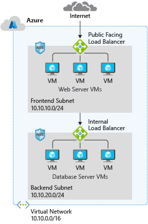

# AZ-700(Azure Network Engineer Associate)

The goal of this repository is to serve as a comprehensive study guide for the AZ-700 exam. This is a work in progress and will be updated continuously as I cover more exam objectives. It includes detailed notes and explanations for each topic based on my understanding. Contributions are welcome; feel free to create a pull request if you wish to add content or correct any errors.

## **Virtual Networks (VNet)**  

A virtual network is a logical representation of your own network. Virtual networks can be used in cloud and hybrid cloud scenarios. When creating a virtual network, you will need to define the address space and create at least one subnet. Subnets in the virtual network subnet must have a unique address range that does not overlap with other subnets. Also consider traffic control, resource isolation, and topology.Azure VNet enables resources in Azure to securely communicate with each other, the internet, and on-premises networks.

- **Capabilities of Azure Virtual Networks**
  - **Communication with the internet**: All resources in a VNet can communicate outbound to the internet by default. You can communicate inbound to a resource by assigning a public IP address or a public Load Balancer. You can also use public IP or public Load Balancer to manage your outbound connections.
  - **Communication between Azure resources**: There are three key mechanisms through which Azure resources can communicate: VNets, VNet service endpoints, and VNet peering. Virtual Networks can connect not only VMs but other Azure resources, such as the App Service Environment, Azure Kubernetes Service, and Azure VM Scale sets. You can use service endpoints to connect to other Azure resource types, such as Azure SQL databases and storage accounts. When you create a VNet, your services and VMs within your VNet can communicate directly and securely with each other in the cloud.
  - **Communication between on-premises resources**: Securely extend your data center. You can connect your on-premises computers and networks to a virtual network using any of the following options: Point-to-site virtual private network (VPN), Site-to-site VPN, Azure ExpressRoute.
  - **Filtering network traffic**: You can filter network traffic between subnets using any combination of network security groups and network virtual appliances like firewalls, gateways, proxies, and Network Address Translation (NAT) services.
  - **Routing network traffic**: Azure routes traffic between subnets, connected virtual networks, on-premises networks, and the Internet by default. You can implement route tables or border gateway protocol (BGP) routes to override the default routes Azure creates.
  
**Enterprise Relevance**: Core component for any cloud architecture.



### **Virtual Network Address Space**

Virtual network address space is the range of IP addresses that you can use for your resources in a virtual network. When you create a virtual network, you must specify a custom private IP address space using public and private (RFC 1918) addresses. Azure assigns resources in a virtual network a private IP address from the address space that you assign. For example, if you deploy a VM in a VNet with address space

### **Private IP Address Space (RFC 1918)**

When creating a VNet, you must specify a custom private IP address space using public and private (RFC 1918) addresses. Azure assigns resources in a virtual network a private IP address from the address space that you assign. For example, if you deploy a VM in a VNet with address space 10.0.0.0/16, the VM will be assigned a private IP like 10.0.0.4.

#### **RFC 1918 Address Ranges:**

- **10.0.0.0 - 10.255.255.255** (10/8 prefix)
- **172.16.0.0 - 172.31.255.255** (172.16/12 prefix)
- **192.168.0.0 - 192.168.255.255** (192.168/16 prefix)

#### **Azure Reserved IP Addresses:**

- **x.x.x.0**: Network address
- **x.x.x.1**: Reserved by Azure for the default gateway
- **x.x.x.2, x.x.x.3**: Reserved by Azure to map the Azure DNS IPs to the VNet space
- **x.x.x.255**: Network broadcast address

#### **Unavailable Address Ranges:**

- **224.0.0.0/4** (Multicast)
- **255.255.255.255/32** (Broadcast)
- **127.0.0.0/8** (Loopback)
- **169.254.0.0/16** (Link-local)
- **168.63.129.16/32** (Internal DNS)

## Subnets

A virtual network can be segmented into one or more subnets Subnets provide logical divisions within your network Subnets can help improve security, increase performance, and make it easier to manage the network
Each subnet must have a unique address range – cannot overlap with other subnets in the virtual network in the subscription
✔️  Azure reserves 5 IP addresses within each subnet.

You can segment VNets into smaller subnets, creating as many subnets as you require within the subscription limit. You can then deploy Azure resources in a specific subnet. Just like in a traditional network, subnets allow you to segment your VNet address space into segments that are appropriate for the organization's internal network. This also improves address allocation efficiency.

When planning to implement subnets, consider the following:

- Each subnet must have a unique address range, specified in Classless Inter-Domain Routing (CIDR) format.
- Certain Azure services require their own subnet.
- Subnets can be used for traffic management. For example, you can create subnets to route traffic through a network virtual appliance.
- You can limit access to Azure resources to specific subnets with a virtual network service endpoint. You can create multiple subnets and enable a service endpoint for some subnets, but not others.
- You can secure resources within subnets using Network Security Groups.

**Enterprise Relevance**: Organizing resources, managing traffic, and security boundaries.

### Azure Reserved IP Addresses:**

- **x.x.x.0**: Network address
- **x.x.x.1**: Reserved by Azure for the default gateway
- **x.x.x.2, x.x.x.3**: Reserved by Azure to map the Azure DNS IPs to the VNet space
- **x.x.x.255**: Network broadcast address

**Enterprise Relevance**: Organizing resources, managing traffic, and security boundaries.


## Understand Regions and Subscriptions

### Regions

A VNet is scoped to a single region/location; however, multiple virtual networks from different regions can be connected using Virtual Network Peering.
[Learn more about Microsoft's global network](https://docs.microsoft.com/azure/networking/microsoft-global-network)  
[Learn more about VNet planning and design](https://docs.microsoft.com/azure/virtual-network/virtual-network-vnet-plan-design-arm#connectivity)

### Subscriptions

All Azure resources are created in an Azure region and subscription. A resource can only be created in a virtual network that exists in the same region and subscription as the resource. However, you can connect virtual networks that exist in different subscriptions and regions. When deciding which region(s) to deploy resources in, consider where consumers of the resources are physically located:

- **Network Latency**: Consumers of resources typically want the lowest network latency to their resources. To determine relative latencies between a specified location and Azure regions, see [View relative latencies](https://docs.microsoft.com/azure/network-watcher/view-relative-latencies?toc=/azure/virtual-network/toc.json).
- **Data Residency, Sovereignty, Compliance, or Resiliency Requirements**: If you have such requirements, choosing the region that aligns with them is critical. For more information, see [Azure geographies](https://azure.microsoft.com/global-infrastructure/geographies/).
- **Resiliency Across Availability Zones**: Do you require resiliency across Azure Availability Zones within the same Azure region for the resources you deploy? You can deploy resources, such as virtual machines (VM), to different availability zones within the same virtual network. Not all Azure regions support availability zones. To learn more about availability zones and the regions that support them, see [Availability zones](https://docs.microsoft.com/azure/availability-zones/az-overview?toc=/azure/virtual-network/toc.json).

### Regional/Global Presence

Azure datacenters exist in many regions worldwide. When selecting multiple Azure datacenters, consider two related factors: geographical distances and latency. To optimize user experience, evaluate the distance between each virtual datacenter as well as the distance from each virtual datacenter to the end users. An Azure region that hosts your virtual datacenter must conform with regulatory requirements of any legal jurisdiction under which your organization operates.


## Create a Virtual Network

Create a virtual network using the Azure portal - [Azure Portal QuickStart](https://docs.microsoft.com/azure/virtual-network/quick-create-portal)

✔️ Always plan to use an address space that is not already in use in your organization, either on-premises or in other VNets. Even if you plan for a VNet to be cloud-only, you may want to make a VPN connection to it later. If there is any overlap in address spaces at that point, you will have to reconfigure or recreate the VNet. The next lesson will focus on IP addressing.

### Best Practices

As you build your network in Azure, it is important to keep in mind the following universal design principles:

- **Ensure non-overlapping address spaces**: Make sure your VNet address space (CIDR block) does not overlap with your organization's other network ranges.
- **Reserve address space for the future**: Your subnets should not cover the entire address space of the VNet. Plan ahead and reserve some address space for the future.
- **Fewer large VNets**: It is recommended you have fewer large VNets rather than multiple small VNets. This will prevent management overhead. (5 IP addresses are not usable per subnet due to Azure reserving them)
- **Secure your VNets**: Secure your VNets by assigning Network Security Groups (NSGs) to the subnets beneath them.

### Create a Virtual Network using Azure CLI

```bash
# filepath: /path/to/azure-cli/commands.sh
az group create --name example-resources --location eastus

az network vnet create \
  --name example-vnet \
  --resource-group example-resources \
  --address-prefix 10.0.0.0/16

az network vnet subnet create \
  --address-prefix 10.0.1.0/24 \
  --name example-subnet \
  --resource-group example-resources \
  --vnet-name example-vnet
```

### Create a Virtual Network using Bicep

```bicep
// filepath: /path/to/bicep/main.bicep
resource rg 'Microsoft.Resources/resourceGroups@2021-04-01' = {
  name: 'example-resources'
  location: 'East US'
}

resource vnet 'Microsoft.Network/virtualNetworks@2021-02-01' = {
  name: 'example-vnet'
  location: rg.location
  properties: {
    addressSpace: {
      addressPrefixes: [
        '10.0.0.0/16'
      ]
    }
  }
}

resource subnet 'Microsoft.Network/virtualNetworks/subnets@2021-02-01' = {
  name: 'example-subnet'
  parent: vnet
  properties: {
    addressPrefix: '10.0.1.0/24'
  }
}
```

### Create a Virtual Network using Terraform

```txt
# filepath: /path/to/terraform/main.tf
provider "azurerm" {
  features {}
}

resource "azurerm_resource_group" "example" {
  name     = "example-resources"
  location = "East US"
}

resource "azurerm_virtual_network" "example" {
  name                = "example-vnet"
  address_space       = ["10.0.0.0/16"]
  location            = azurerm_resource_group.example.location
  resource_group_name = azurerm_resource_group.example.name
}

resource "azurerm_subnet" "example" {
  name                 = "example-subnet"
  resource_group_name  = azurerm_resource_group.example.name
  virtual_network_name = azurerm_virtual_network.example.name
  address_prefixes     = ["10.0.1.0/24"]
}
```


## Public IP Addresses

Public IP addresses enable Azure resources to communicate to the internet, and to other Azure resources.

In Azure Resource Manager, a public IP address is a resource that has its own properties. Some of the resources you can associate a public IP address resource with include:

- Virtual machine network interfaces
- Virtual machine scale sets
- Public Load Balancers
- Virtual Network Gateways (VPN/ER)
- NAT gateways
- Application Gateways
- Azure Firewall
- Bastion Host
- Route Server

For the full chart of resources, see here: [Public IP addresses in Azure - Azure Virtual Network](https://docs.microsoft.com/azure/virtual-network/ip-services/public-ip-addresses#at-a-glance)

Public IP addresses are created with an IPv4 or IPv6 address, which can be either static or dynamic.

- **Dynamic Public IP Address**: A dynamic public IP address is an assigned address that can change over the lifespan of the Azure resource. The dynamic IP address is allocated when you create or start a VM. The IP address is released when you stop or delete the VM. In each Azure region, public IP addresses are assigned from a unique pool of addresses. The default allocation method is dynamic.
- **Static Public IP Address**: A static public IP address is an assigned address that will not change over the lifespan of the Azure resource. To ensure that the IP address for the resource remains the same, set the allocation method explicitly to static. In this case, an IP address is assigned immediately. It is released only when you delete the public IP resource or change the IP allocation method to dynamic.

Learn more about Public IP addresses - [Public IP addresses in Azure](https://docs.microsoft.com/azure/virtual-network/public-ip-addresses)


### Choose the appropriate SKU for a public IP

For public IP addresses, there are two types of SKUs to choose from: Basic and Standard. All public IP addresses created before the introduction of SKUs are Basic SKU public IP addresses. With the introduction of SKUs, you have the option to specify which SKU you would like the public IP address to be.

On September 30, 2025, Basic SKU public IPs will be retired. Learn more here: [Public IP Upgrade Portal](https://learn.microsoft.com/azure/virtual-network/ip-services/public-ip-upgrade-portal)

- **Basic SKU**: Basic SKU public IPs can be assigned using static or dynamic allocation methods. Basic IPs are open by default, so the use of Network Security Groups (NSGs) is recommended but optional for restricting inbound or outbound traffic. Basic public IPs can be assigned to any Azure resource that can be assigned a public IP address, such as network interfaces, VPN gateways, application gateways, and internet-facing load balancers. They do not support availability zone scenarios. You must use a Standard SKU public IP for an availability zone scenario.
- **Standard SKU**: Standard SKU public IP addresses always use the static allocation method. Standard IPs are secure by default and closed to inbound traffic. You must explicitly allow inbound traffic by using a network security group. Standard IPs can be assigned to network interfaces, Standard public load balancers, application gateways, or VPN gateways. Standard IPs are zone-redundant by default and optionally zonal (they can be created zonal and guaranteed in a specific availability zone).

Basic SKU IPv4 addresses can be upgraded after creation to Standard SKU. A standalone virtual machine, virtual machines within an availability set, or virtual machine scale sets can use Basic or Standard SKUs. Mixing SKUs between virtual machines within availability sets or scale sets or standalone VMs is not allowed.

Upgrade to Standard SKU public IP addresses in Azure by September 30, 2025—Basic SKU will be retired. Learn more here: [Upgrade to Standard SKU](https://azure.microsoft.com/updates/upgrade-to-standard-sku-public-ip-addresses-in-azure-by-30-september-2025-basic-sku-will-be-retired/)


### Create a Public IP Address using Azure CLI

```bash
# filepath: /path/to/azure-cli/commands.sh
az network public-ip create \
  --name example-public-ip \
  --resource-group example-resources \
  --allocation-method Static
```

### Create a Public IP Address using Bicep

```bicep
// filepath: /path/to/bicep/main.bicep
resource publicIp 'Microsoft.Network/publicIPAddresses@2021-02-01' = {
  name: 'example-public-ip'
  location: rg.location
  properties: {
    publicIPAllocationMethod: 'Static'
  }
}
```

### Create a Public IP Address using Terraform

```txt
# filepath: /path/to/terraform/main.tf
resource "azurerm_public_ip" "example" {
  name                = "example-public-ip"
  location            = azurerm_resource_group.example.location
  resource_group_name = azurerm_resource_group.example.name
  allocation_method   = "Static"
}
```

## Custom IP Address Prefix (Bring Your Own IP)

A custom IP address prefix is a contiguous range of IP addresses owned by an external customer and provisioned into a subscription. Microsoft is permitted to advertise the range. Addresses from a custom IP address prefix can be used in the same way as Azure-owned public IP address prefixes. These addresses can be associated with Azure resources, interact with internal/private IPs and virtual networks, and reach external destinations outbound from the Azure Wide Area Network.

### Retain IP Ranges (BYOIP)

Retaining IP ranges allows you to maintain established reputation and continue to pass through externally controlled allowlists.

### Three-Phase Process to Bring an IP Prefix to Azure

1. **Validation**: Verify that the IP prefix is owned by you and can be brought to Azure.
2. **Provision**: Provision the IP prefix into your Azure subscription.
3. **Commission**: Commission the IP prefix to be used with Azure resources.

Learn more about Custom IP address prefix (BYOIP) - [Azure Virtual Network | Microsoft Learn](https://learn.microsoft.com/azure/virtual-network/ip-services/custom-ip-address-prefix)


## Public DNS

The Domain Name System (DNS) is a hierarchical and decentralized naming system for computers, services, or other resources connected to the Internet or a private network. It associates various information with domain names assigned to each of the participating entities. Most prominently, it translates more readily memorized domain names to the numerical IP addresses needed for locating and identifying computer services and devices with the underlying network protocols.

Public DNS services resolve names and IP addresses for resources and services accessible over the internet such as web servers.
In Azure DNS, you can manually create address records within relevant zones. The most frequently used records are:

- **Host records**: A (IPv4) / AAAA (IPv6)
- **Alias records**: CNAME


## Azure DNS Zones

A DNS zone hosts the DNS records for a domain. The same zone name can be reused in a different resource group or a different Azure subscription. When multiple zones share the same name, each instance is assigned different name server addresses.

### Key Points

- **DNS Zone Hosting**: A DNS zone is a container for DNS records of a specific domain. It allows you to manage the DNS records for that domain.
- **Reuse of Zone Names**: The same DNS zone name can be reused in different resource groups or Azure subscriptions. This means you can have multiple instances of the same DNS zone name, each managed independently.
- **Name Server Addresses**: When multiple zones share the same name, each instance is assigned different name server addresses. This ensures that DNS queries are directed to the correct instance of the DNS zone.
- **Root/Parent Domain Registration**: The root or parent domain is registered at the domain registrar and pointed to Azure Name Servers. This allows Azure DNS to manage the DNS records for the domain.


Learn more about Azure DNS - [What is Azure DNS? | Microsoft Docs](https://docs.microsoft.com/azure/dns/dns-overview)


### DNS Delegation

When delegating a domain to Azure DNS, you must use the name server names provided by Azure DNS. It is important to use all four name servers provided. Once the DNS zone is created, update the parent registrar with these name server names.

For child zones, register the NS records in the parent domain to delegate the child zone.


### DNS Record Types

A record set is a collection of records in a zone that have the same name and are of the same type. Azure DNS supports all common DNS record types, including A, AAAA, CAA, CNAME, MX, NS, PTR, SOA, SRV, and TXT.

- **A Record**: Maps a domain name to an IPv4 address.
- **AAAA Record**: Maps a domain name to an IPv6 address.
- **CAA Record**: Specifies which certificate authorities are allowed to issue certificates for a domain.
- **CNAME Record**: Maps a domain name to another domain name (alias).
- **MX Record**: Specifies the mail servers for a domain.
- **NS Record**: Specifies the authoritative name servers for a domain.
- **PTR Record**: Maps an IP address to a domain name (reverse DNS lookup).
- **SOA Record**: Contains administrative information about the zone.
- **SRV Record**: Specifies the location of services.
- **TXT Record**: Allows you to associate arbitrary text with a domain.

A record set cannot contain two identical records. Changing the drop-down Type in the Azure portal changes the information required for the record set.

